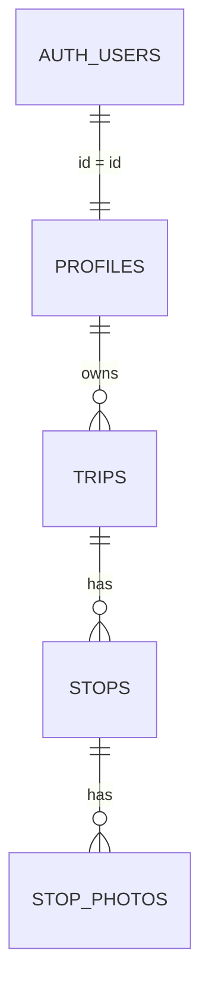

# onMyWay — MVP Plan

Status: **v2 — owner decisions applied, waiting for review** (2026-10-03)
Stack: Expo SDK 57, React Native 0.86, TypeScript, Expo Router, Supabase, react-native-maps.

MVP scope: auth, profile, create trip, feed, trip detail map + "Follow this trip".
Out of scope (later phases): likes, comments, follows, notifications, chat, search/explore, nearby trips.

---

## 0. Owner decisions (final)

| # | Question | Decision |
|---|---|---|
| 1 | Logged-out access? | **Login wall.** No anon access: `anon` removed from all SELECT policies, storage select and the `get_feed` grant |
| 2 | Email confirmation at sign-up? | **Off for dev** (turn on before launch) |
| 3 | Place search provider | **Nominatim** — search on submit only (no autocomplete), max 1 request/s, identifying `User-Agent` |
| 4 | Limits | **20 stops / trip, 5 photos / stop** (enforced in client and DB) |
| 5 | Drafts | **Local-only on device** |
| 6 | Create entry point | **"+" button in the Feed header** |
| 7 | Feed order | **`created_at`** — drafts are local, so the trip row is created at publish time |
| 8 | All profiles public (to signed-in users)? | **Yes** |

### Publish flow

1. Validate locally (title, 1–20 stops, ≤5 photos per stop).
2. Insert the trip with `visibility = 'private'` → get `trip_id`.
3. Upload cover + stop photos to `trip-photos/{user_id}/{trip_id}/{uuid}.{ext}` (compressed, per-photo progress + retry).
4. Insert all stops in one request, then all `stop_photos` in one request.
5. Update the trip to the visibility chosen in the form (`public` or keep `private`).
6. Clear the local draft and navigate to `trip/[id]`.

If any step fails, the trip stays private (invisible to others). The app keeps the local draft and offers **Retry** (resumes with the existing `trip_id`) or **Discard** (deletes uploaded files, then the trip row).

### Nominatim usage rules

- Search runs only when the user submits the search field — no autocomplete / search-as-you-type.
- Client-side throttle: at most 1 request per second (shared by search and reverse geocoding); queue or ignore extra calls.
- Send an identifying `User-Agent` (e.g. `onMyWay/<app version> (<contact email>)`) — contact address to be provided by the owner, kept in config, not hard-coded in many places.
- Reverse geocoding only on pin confirm, not on every map pan.
- Cache recent results in memory; show OSM attribution ("© OpenStreetMap contributors") on the picker.

### Libraries to install (need your approval)

| Library | Why |
|---|---|
| `@supabase/supabase-js`, `react-native-url-polyfill` | Supabase client |
| `expo-secure-store` | Store auth session securely |
| `react-native-maps` | Map, markers, route line (needs dev build; Google Maps API key on Android) |
| `expo-location` | "Use my location", reverse geocoding |
| `expo-image-picker`, `expo-image-manipulator` | Pick, crop and compress photos |
| `@react-native-async-storage/async-storage` | Local trip drafts |
| `react-native-draggable-flatlist` | Drag to reorder stops (uses installed gesture-handler + reanimated) |

Note: `react-native-maps` means Expo Go is no longer enough — we need a development build (`npx expo run:android|ios` or `eas build --profile development`).

### Points where design and DB were reconciled

- **Username at sign-up:** the DB trigger creates the profile with a generated username (`user_xxxxxxxxxxxx`) and never trusts client metadata. Right after sign-up the app updates the profile with the chosen username; if it is taken (error `23505`), the user is asked to pick another before entering the app.
- **Trip visibility default:** DB default is `private` (safe default); the create form preselects `Public` explicitly.
- **Bio length:** designer proposed 160 chars, DB 300. Proposal: **160 in both** (DB CHECK updated before migration).
- **Feed page size:** 20 per page (DB caps at 50).
- **Drafts:** local-only, so the DB has no `status` column. Only "Publish" writes to Supabase and uploads photos (see Publish flow).
- **Auth gating:** login wall — every screen except sign-in/sign-up is inside the protected `(app)` group, matching the DB (no anon access).
- **"Follow this trip":** Google Maps URLs support a limited number of waypoints (~9). Trips with more stops will be split into legs or show a warning — to verify during implementation.

---

## 1. Screens & Navigation

Existing template: `src/app/_layout.tsx` renders `AppTabs` (NativeTabs) directly, with `index.tsx` and `explore.tsx` at root. These move into a `(tabs)` group, the root becomes a `Stack`, and "Explore" is removed. Existing `theme.ts`, `use-theme`, `themed-text`/`themed-view` are reused. The coder must check the SDK 57 docs for the current `NativeTabs` icon API and `Stack.Protected`.

### 1.1 Route tree

```
src/app/
  _layout.tsx                  Root: providers (Theme, Session, SafeArea), splash, <Stack> with Stack.Protected guards
  (auth)/
    _layout.tsx                Stack, headerShown false
    sign-in.tsx
    sign-up.tsx
  (app)/
    _layout.tsx                Stack (holds tabs + pushed screens)
    (tabs)/
      _layout.tsx              <AppTabs/> (NativeTabs)
      index.tsx                Feed
      profile.tsx              My profile
    trip/
      [id].tsx                 Trip detail
      new.tsx                  Create trip (fullScreenModal)
      [id]/edit.tsx            Edit trip (reuses the trip form)
    user/
      [username].tsx           Other user's profile
    profile/
      edit.tsx                 Edit profile (modal)
    pick-location.tsx          Map/search location picker (modal)
```

**Auth gating** (root `_layout.tsx`):
- `SessionProvider` wraps Supabase `getSession()` + `onAuthStateChange`, exposes `{ session, isLoading }`.
- Splash stays visible while `isLoading`.
- `Stack.Protected guard={!!session}` around `(app)`, `Stack.Protected guard={!session}` around `(auth)`. Sign in/out flips the guard; Expo Router redirects automatically.
- Login wall: nothing except `(auth)` is reachable without a session. Signed-out deep link to `trip/[id]` → sign-in → feed (deep-link resume later).
- Session stored with `expo-secure-store` via a custom Supabase storage adapter (security review required).

### 1.2 Tabs

| Tab | Route | iOS SF Symbol | Android Material | Why |
|---|---|---|---|---|
| Feed | `(tabs)/index` | `house` / `house.fill` | `home` | Main discovery surface |
| Profile | `(tabs)/profile` | `person` / `person.fill` | `person` | Own trips, edit profile, sign out |

Create trip is not a tab (NativeTabs can't host a custom centre button). Entry points: "+" in the Feed header and "Create your first trip" CTAs in empty states. Full-screen modal hides the tab bar, which suits a long form.

### 1.3 Screens

| Screen | Route | Key UI | Primary actions | Empty / loading / error |
|---|---|---|---|---|
| Sign in | `(auth)/sign-in` | Logo, email, password (show/hide), link to sign-up | Sign in | Inline field errors, "Invalid credentials" banner, spinner + disabled button while submitting |
| Sign up | `(auth)/sign-up` | Email, password, username (unique check on blur), display name | Sign up | Taken username / weak password inline; "Check your email" state if confirmation is on |
| Feed | `(tabs)/index` | `FlatList` of `TripCard` (cover, title, author, stop count, relative date), "+" header button | Pull to refresh, infinite scroll (keyset cursor), tap card / author | Skeleton cards; "No trips yet. Be the first." + CTA; retry banner; footer spinner; "You're all caught up" |
| Trip detail | `trip/[id]` | Cover hero, title, author row, description, `TripMap` (numbered markers + polyline, fit to bounds), ordered stop list (name, note, photo carousel), sticky "Follow this trip" | Follow, tap stop → centre map, tap author; owner: Edit / Delete / visibility in header menu | Skeleton; "Trip unavailable" (not found / private); no stops → map hidden, Follow disabled; map failure → list still works |
| Create / edit trip | `trip/new`, `trip/[id]/edit` | See 1.5 | Publish, Save draft, Discard | Title required, ≥1 stop to publish; per-photo upload progress + retry |
| Pick location | `pick-location` | Full-screen map, centred pin, search bar (submit to search) + results, "Use my location", confirm bar with address, OSM attribution | Pan, search, confirm | Permission denied → map still works + hint; "No places found" |
| My profile | `(tabs)/profile` | Avatar, display name, @username, bio, trip count, "Edit profile", trip list (lock badge on private), menu with Sign out | Edit profile, open/create trip, sign out | "You haven't created a trip" + CTA; skeleton; retry |
| Other profile | `user/[username]` | Same header without edit, public trips only | Open trip | "User not found"; "No public trips yet" |
| Edit profile | `profile/edit` | Avatar picker, fields with counters (bio 160), Save in header | Save, Cancel | Username taken inline; unsaved-changes confirm; avatar upload progress |

Cross-cutting: touch targets ≥ 44×44; every icon button has `accessibilityLabel`; safe areas respected (sticky buttons above home indicator); dark mode via existing theme; keyboard never covers inputs.

### 1.4 Key user flows

**Sign up → first trip**
1. No session → Sign in → "Create account".
2. Enter email, password, username, display name → submit (profile auto-created, then username updated).
3. Guard flips → empty Feed with CTA.
4. Tap "+" → `trip/new`.
5. Title, optional cover/description, add stops.
6. Publish → modal closes → `trip/[id]`.

**Feed → trip detail → follow**
1. Pull to refresh / scroll to load more.
2. Tap card → `trip/[id]`; review map, route, stops.
3. "Follow this trip" builds a directions URL from the ordered stops.
4. iOS: action sheet Apple Maps / Google Maps. Android: Google Maps.

**Edit profile**
1. Profile tab → "Edit profile" (modal).
2. Tap avatar → pick photo → square crop → upload to Storage.
3. Edit display name, username, bio → Save. Taken username → inline error, form stays open.

### 1.5 Create-trip UX

Recommendation: **one scrolling screen, not a wizard.**
- Sections: (1) cover photo + title, (2) description + visibility toggle (default Public), (3) stops list + "Add stop", (4) sticky footer with Publish / Save draft.
- **Add stop:** opens `pick-location` modal — search bar on top, map with pin; search moves the pin, panning is the fallback. Confirm returns `{lat, lng, name, address}`; reverse geocoding gives an editable default name.
- **Stop card:** drag handle, order number, name, multiline note, photo strip (max 5, "add photo" tile), delete (confirm only if the stop has content).
- **Reorder:** drag handle; "Move up / Move down" in the card menu for accessibility. Saved via `reorder_stops` RPC.
- **Delete:** swipe/menu with an undo snackbar.
- **Limits:** "Add stop" is disabled at 20 stops; "add photo" tile hidden at 5 photos per stop.
- **Drafts:** auto-saved locally on change; "Resume draft" when reopening `trip/new`. Only Publish writes to Supabase (see Publish flow in section 0); photos are compressed on pick and uploaded on Publish.
- Leaving with unsaved changes → "Save draft / Discard / Keep editing".

### 1.6 Shared code (outside `src/app/`)

| Path | Notes |
|---|---|
| `components/ui/button.tsx` | Primary / secondary / destructive, loading state |
| `components/ui/text-field.tsx` | Label, error text, secure toggle |
| `components/ui/avatar.tsx` | Image + initials fallback |
| `components/ui/screen.tsx` | Safe-area wrapper, themed background |
| `components/ui/skeleton.tsx`, `empty-state.tsx`, `error-banner.tsx`, `icon-button.tsx` | States and accessible icon buttons |
| `components/trip/trip-card.tsx` | Feed and profile item |
| `components/trip/trip-map.tsx` (+ `.web.tsx` fallback) | Markers + polyline; react-native-maps has no web support |
| `components/trip/stop-list-item.tsx`, `stop-editor-card.tsx`, `photo-strip.tsx` | Stop display / editing |
| `components/trip/follow-trip-button.tsx` | Builds map URLs + platform action sheet |
| `components/profile/profile-header.tsx` | Shared by own / other profile |
| `lib/supabase.ts`, `lib/maps-links.ts` | Supabase client, map URL builder |
| `providers/session-provider.tsx` | Session state |
| `hooks/use-feed.ts`, `use-trip.ts`, `use-image-upload.ts` | Data hooks |
| `types/database.ts` | Generated with `supabase gen types typescript` |
| `constants/theme.ts` | Extend with spacing, radius, typography tokens |

---

## 2. Database (Supabase)

### 2.1 ER overview



### 2.2 Tables

**Lat/lng:** `double precision` with CHECK ranges, not PostGIS. The MVP has no spatial queries and react-native-maps wants plain numbers. "Nearby trips" later can add a generated `geography(Point)` column + GiST index without breaking anything.

**`profiles`** — `id` uuid PK → `auth.users` ON DELETE CASCADE · `username` text NOT NULL UNIQUE, CHECK `^[a-z0-9_]{3,30}$` (lowercase, so case-insensitive) · `display_name` text NOT NULL (1..50) · `avatar_path` text (storage path) · `bio` text (≤160) · `created_at`, `updated_at`.

**`trips`** — `id` uuid PK · `owner_id` → `profiles` ON DELETE CASCADE · `title` (1..120) · `description` (≤5000) · `cover_path` · `visibility` text NOT NULL default `'private'`, CHECK in (`public`,`private`) · `created_at`, `updated_at`.

**`stops`** — `id` uuid PK · `trip_id` → `trips` ON DELETE CASCADE · `position` int ≥0 · `name` (1..120) · `lat` (-90..90) · `lng` (-180..180) · `address` · `notes` (≤5000) · timestamps · `UNIQUE (trip_id, position) DEFERRABLE INITIALLY DEFERRED`.

**`stop_photos`** — `id` uuid PK · `stop_id` → `stops` ON DELETE CASCADE · `position` int ≥0 · `storage_path` NOT NULL · `created_at` · `UNIQUE (stop_id, position) DEFERRABLE INITIALLY DEFERRED`.

Cascades remove rows only — Storage files are not deleted automatically (see risks).

### 2.3 Indexes

- `trips_feed_idx` on `trips (created_at DESC, id DESC) WHERE visibility = 'public'` — keyset-paginated feed.
- `trips_owner_idx` on `trips (owner_id, created_at DESC)` — my trips / profile page, FK, RLS owner checks.
- Unique constraints already index `stops (trip_id, position)`, `stop_photos (stop_id, position)`, `profiles.username`.

### 2.4 Triggers & functions

- **`handle_new_user()`** — AFTER INSERT on `auth.users`, `SECURITY DEFINER`, `search_path = ''`. Creates the profile with username `user_<12 hex of id>`; takes `display_name` from metadata (capped 50, fallback `'Traveller'`); never trusts a client-supplied username. Execute revoked from public/anon/authenticated.
- **`set_updated_at()`** — BEFORE UPDATE on profiles, trips, stops.
- **Stop ordering** — dense integer positions; deferred unique constraint is checked at commit, so permutations never conflict mid-statement.
  - Append: BEFORE INSERT trigger sets `position = max + 1` when NULL, locking the parent row to serialise concurrent appends (same for photos).
  - Reorder: RPCs `reorder_stops(trip_id, ids[])` / `reorder_stop_photos(stop_id, ids[])`, `SECURITY INVOKER`, lock parent, validate the id set exactly, single `UPDATE ... FROM unnest(...) WITH ORDINALITY`.
  - Deleting leaves gaps — harmless, next reorder normalises.
  - Do **not** upsert with `onConflict` on `(trip_id, position)` (deferrable constraints can't be arbiters).

### 2.5 RLS policies

RLS on all tables; **`anon` has no privileges at all** (login wall); all policies are `to authenticated` and use `(select auth.uid())`.

| Table | SELECT | INSERT | UPDATE | DELETE |
|---|---|---|---|---|
| profiles | authenticated: all | none (trigger) | `id = auth.uid()` | none (cascade) |
| trips | `visibility = 'public'` OR owner | `owner_id = auth.uid()` | owner (using + check) | owner |
| stops | parent trip visible to caller | trip owned by caller | trip owner | trip owner |
| stop_photos | parent stop visible to caller | stop's trip owned by caller | same | same |

Limits: the position triggers also reject the 21st stop of a trip and the 6th photo of a stop (`stop limit reached` / `photo limit reached`).

### 2.6 Storage

| Bucket | Public | Limit | MIME | Path |
|---|---|---|---|---|
| `avatars` | yes | 2 MB | jpeg/png/webp | `{user_id}/{uuid}.{ext}` |
| `trip-photos` | no | 10 MB | jpeg/png/webp | `{user_id}/{trip_id}/{uuid}.{ext}` |

- `avatars`: write/update/delete only when folder 1 = `auth.uid()`. Unique filenames, delete the old avatar on replace.
- `trip-photos`: private so private-trip photos can't be fetched by URL guessing. Authenticated only.
  - SELECT if folder 1 = `auth.uid()` (own files), OR a trip exists with `id` = folder 2, **`owner_id` = folder 1**, and `visibility = 'public'` (stops someone placing files under another user's public trip id).
  - INSERT/UPDATE/DELETE only in own folder; insert/update also require folder 2 to be a trip owned by the caller (the trip row exists first — see Publish flow).
  - Client uses batched `createSignedUrls` (1 h TTL). Covers live here too.
- Resize client-side before upload.

### 2.7 Feed query

RPC `get_feed(p_before_created_at, p_before_id, p_limit)` — granted to `authenticated` only, `SECURITY INVOKER` (RLS still applies), keyset on `(created_at, id)`, page capped at 50, returns trip + author profile + stop count in one query.

```ts
supabase.rpc('get_feed', { p_before_created_at: last?.created_at ?? null, p_before_id: last?.trip_id ?? null, p_limit: 20 })
```

If a view is ever used instead, it must be `with (security_invoker = true)`.

### 2.8 Migration draft — `supabase/migrations/0001_init.sql`

> Draft for review. Bio CHECK set to 160 per the reconciliation above. If decision #7 is `published_at`, a column + trigger + index change will be added before applying.

```sql
-- 0001_init.sql : MVP schema (profiles, trips, stops, stop_photos, storage, feed)

-- ---------- helper trigger functions ----------
create function public.set_updated_at()
returns trigger language plpgsql set search_path = '' as $$
begin
  new.updated_at = now();
  return new;
end $$;

-- ---------- tables ----------
create table public.profiles (
  id           uuid primary key references auth.users(id) on delete cascade,
  username     text not null unique check (username ~ '^[a-z0-9_]{3,30}$'),
  display_name text not null check (char_length(display_name) between 1 and 50),
  avatar_path  text,
  bio          text check (char_length(bio) <= 160),
  created_at   timestamptz not null default now(),
  updated_at   timestamptz not null default now()
);

create table public.trips (
  id          uuid primary key default gen_random_uuid(),
  owner_id    uuid not null references public.profiles(id) on delete cascade,
  title       text not null check (char_length(title) between 1 and 120),
  description text check (char_length(description) <= 5000),
  cover_path  text,
  visibility  text not null default 'private' check (visibility in ('public','private')),
  created_at  timestamptz not null default now(),
  updated_at  timestamptz not null default now()
);

create table public.stops (
  id         uuid primary key default gen_random_uuid(),
  trip_id    uuid not null references public.trips(id) on delete cascade,
  position   integer not null check (position >= 0),
  name       text not null check (char_length(name) between 1 and 120),
  lat        double precision not null check (lat between -90 and 90),
  lng        double precision not null check (lng between -180 and 180),
  address    text,
  notes      text check (char_length(notes) <= 5000),
  created_at timestamptz not null default now(),
  updated_at timestamptz not null default now(),
  constraint stops_trip_position_uq unique (trip_id, position) deferrable initially deferred
);

create table public.stop_photos (
  id           uuid primary key default gen_random_uuid(),
  stop_id      uuid not null references public.stops(id) on delete cascade,
  position     integer not null check (position >= 0),
  storage_path text not null,
  created_at   timestamptz not null default now(),
  constraint stop_photos_stop_position_uq unique (stop_id, position) deferrable initially deferred
);

-- ---------- indexes ----------
create index trips_feed_idx  on public.trips (created_at desc, id desc) where visibility = 'public';
create index trips_owner_idx on public.trips (owner_id, created_at desc);

-- ---------- updated_at triggers ----------
create trigger profiles_updated_at before update on public.profiles
  for each row execute function public.set_updated_at();
create trigger trips_updated_at before update on public.trips
  for each row execute function public.set_updated_at();
create trigger stops_updated_at before update on public.stops
  for each row execute function public.set_updated_at();

-- ---------- auto-create profile ----------
create function public.handle_new_user()
returns trigger language plpgsql security definer set search_path = '' as $$
begin
  insert into public.profiles (id, username, display_name)
  values (
    new.id,
    'user_' || substr(replace(new.id::text, '-', ''), 1, 12),
    coalesce(nullif(left(new.raw_user_meta_data ->> 'display_name', 50), ''), 'Traveller')
  );
  return new;
end $$;
revoke execute on function public.handle_new_user() from public, anon, authenticated;

create trigger on_auth_user_created after insert on auth.users
  for each row execute function public.handle_new_user();

-- ---------- append position (serialised per parent) ----------
create function public.stops_set_position()
returns trigger language plpgsql set search_path = '' as $$
begin
  if new.position is null then
    perform 1 from public.trips where id = new.trip_id for update;
    select coalesce(max(position), -1) + 1 into new.position
      from public.stops where trip_id = new.trip_id;
  end if;
  return new;
end $$;
create trigger stops_before_insert before insert on public.stops
  for each row execute function public.stops_set_position();

create function public.stop_photos_set_position()
returns trigger language plpgsql set search_path = '' as $$
begin
  if new.position is null then
    perform 1 from public.stops where id = new.stop_id for update;
    select coalesce(max(position), -1) + 1 into new.position
      from public.stop_photos where stop_id = new.stop_id;
  end if;
  return new;
end $$;
create trigger stop_photos_before_insert before insert on public.stop_photos
  for each row execute function public.stop_photos_set_position();

-- ---------- reorder RPCs (security invoker: RLS applies) ----------
create function public.reorder_stops(p_trip_id uuid, p_ids uuid[])
returns void language plpgsql security invoker set search_path = '' as $$
declare n int := coalesce(array_length(p_ids, 1), 0);
begin
  perform 1 from public.trips
    where id = p_trip_id and owner_id = (select auth.uid()) for update;
  if not found then raise exception 'trip not found or not owner' using errcode = '42501'; end if;

  if (select count(distinct x) from unnest(p_ids) x) <> n
     or (select count(*) from public.stops where trip_id = p_trip_id) <> n
     or (select count(*) from public.stops where trip_id = p_trip_id and id = any(p_ids)) <> n then
    raise exception 'ids must be exactly the stops of this trip' using errcode = '22023';
  end if;

  update public.stops s set position = u.ord - 1
    from unnest(p_ids) with ordinality as u(id, ord)
    where s.id = u.id and s.trip_id = p_trip_id;
end $$;

create function public.reorder_stop_photos(p_stop_id uuid, p_ids uuid[])
returns void language plpgsql security invoker set search_path = '' as $$
declare n int := coalesce(array_length(p_ids, 1), 0);
begin
  perform 1 from public.stops s join public.trips t on t.id = s.trip_id
    where s.id = p_stop_id and t.owner_id = (select auth.uid()) for update of s;
  if not found then raise exception 'stop not found or not owner' using errcode = '42501'; end if;

  if (select count(distinct x) from unnest(p_ids) x) <> n
     or (select count(*) from public.stop_photos where stop_id = p_stop_id) <> n
     or (select count(*) from public.stop_photos where stop_id = p_stop_id and id = any(p_ids)) <> n then
    raise exception 'ids must be exactly the photos of this stop' using errcode = '22023';
  end if;

  update public.stop_photos p set position = u.ord - 1
    from unnest(p_ids) with ordinality as u(id, ord)
    where p.id = u.id and p.stop_id = p_stop_id;
end $$;

revoke execute on function public.reorder_stops(uuid, uuid[]), public.reorder_stop_photos(uuid, uuid[])
  from public, anon;
grant execute on function public.reorder_stops(uuid, uuid[]), public.reorder_stop_photos(uuid, uuid[])
  to authenticated;

-- ---------- feed ----------
create function public.get_feed(
  p_before_created_at timestamptz default null,
  p_before_id uuid default null,
  p_limit int default 20
)
returns table (
  trip_id uuid, title text, description text, cover_path text, created_at timestamptz,
  owner_id uuid, username text, display_name text, avatar_path text, stop_count int
)
language sql stable security invoker set search_path = '' as $$
  select t.id, t.title, t.description, t.cover_path, t.created_at,
         p.id, p.username, p.display_name, p.avatar_path,
         (select count(*)::int from public.stops s where s.trip_id = t.id)
  from public.trips t
  join public.profiles p on p.id = t.owner_id
  where t.visibility = 'public'
    and (p_before_created_at is null or (t.created_at, t.id) < (p_before_created_at, p_before_id))
  order by t.created_at desc, t.id desc
  limit least(greatest(p_limit, 1), 50)
$$;
revoke execute on function public.get_feed(timestamptz, uuid, int) from public;
grant execute on function public.get_feed(timestamptz, uuid, int) to anon, authenticated;

-- ---------- RLS ----------
alter table public.profiles    enable row level security;
alter table public.trips       enable row level security;
alter table public.stops       enable row level security;
alter table public.stop_photos enable row level security;

revoke insert, update, delete on all tables in schema public from anon;

-- profiles
create policy profiles_select on public.profiles for select to anon, authenticated using (true);
create policy profiles_update on public.profiles for update to authenticated
  using (id = (select auth.uid())) with check (id = (select auth.uid()));

-- trips
create policy trips_select on public.trips for select to anon, authenticated
  using (visibility = 'public' or owner_id = (select auth.uid()));
create policy trips_insert on public.trips for insert to authenticated
  with check (owner_id = (select auth.uid()));
create policy trips_update on public.trips for update to authenticated
  using (owner_id = (select auth.uid())) with check (owner_id = (select auth.uid()));
create policy trips_delete on public.trips for delete to authenticated
  using (owner_id = (select auth.uid()));

-- stops (visibility inherited through trips RLS)
create policy stops_select on public.stops for select to anon, authenticated
  using (exists (select 1 from public.trips t where t.id = stops.trip_id));
create policy stops_insert on public.stops for insert to authenticated
  with check (exists (select 1 from public.trips t
                      where t.id = stops.trip_id and t.owner_id = (select auth.uid())));
create policy stops_update on public.stops for update to authenticated
  using (exists (select 1 from public.trips t
                 where t.id = stops.trip_id and t.owner_id = (select auth.uid())))
  with check (exists (select 1 from public.trips t
                      where t.id = stops.trip_id and t.owner_id = (select auth.uid())));
create policy stops_delete on public.stops for delete to authenticated
  using (exists (select 1 from public.trips t
                 where t.id = stops.trip_id and t.owner_id = (select auth.uid())));

-- stop_photos
create policy stop_photos_select on public.stop_photos for select to anon, authenticated
  using (exists (select 1 from public.stops s where s.id = stop_photos.stop_id));
create policy stop_photos_insert on public.stop_photos for insert to authenticated
  with check (exists (select 1 from public.stops s join public.trips t on t.id = s.trip_id
                      where s.id = stop_photos.stop_id and t.owner_id = (select auth.uid())));
create policy stop_photos_update on public.stop_photos for update to authenticated
  using (exists (select 1 from public.stops s join public.trips t on t.id = s.trip_id
                 where s.id = stop_photos.stop_id and t.owner_id = (select auth.uid())))
  with check (exists (select 1 from public.stops s join public.trips t on t.id = s.trip_id
                      where s.id = stop_photos.stop_id and t.owner_id = (select auth.uid())));
create policy stop_photos_delete on public.stop_photos for delete to authenticated
  using (exists (select 1 from public.stops s join public.trips t on t.id = s.trip_id
                 where s.id = stop_photos.stop_id and t.owner_id = (select auth.uid())));

-- ---------- storage ----------
insert into storage.buckets (id, name, public, file_size_limit, allowed_mime_types) values
  ('avatars',     'avatars',     true,  2097152,  array['image/jpeg','image/png','image/webp']),
  ('trip-photos', 'trip-photos', false, 10485760, array['image/jpeg','image/png','image/webp'])
on conflict (id) do nothing;

create policy avatars_insert on storage.objects for insert to authenticated
  with check (bucket_id = 'avatars' and (storage.foldername(name))[1] = (select auth.uid())::text);
create policy avatars_update on storage.objects for update to authenticated
  using (bucket_id = 'avatars' and (storage.foldername(name))[1] = (select auth.uid())::text)
  with check (bucket_id = 'avatars' and (storage.foldername(name))[1] = (select auth.uid())::text);
create policy avatars_delete on storage.objects for delete to authenticated
  using (bucket_id = 'avatars' and (storage.foldername(name))[1] = (select auth.uid())::text);

create policy trip_photos_select on storage.objects for select to anon, authenticated
  using (
    bucket_id = 'trip-photos'
    and (
      (storage.foldername(name))[1] = (select auth.uid())::text
      or exists (select 1 from public.trips t
                 where t.id::text = (storage.foldername(name))[2] and t.visibility = 'public')
    )
  );
create policy trip_photos_insert on storage.objects for insert to authenticated
  with check (bucket_id = 'trip-photos' and (storage.foldername(name))[1] = (select auth.uid())::text);
create policy trip_photos_update on storage.objects for update to authenticated
  using (bucket_id = 'trip-photos' and (storage.foldername(name))[1] = (select auth.uid())::text)
  with check (bucket_id = 'trip-photos' and (storage.foldername(name))[1] = (select auth.uid())::text);
create policy trip_photos_delete on storage.objects for delete to authenticated
  using (bucket_id = 'trip-photos' and (storage.foldername(name))[1] = (select auth.uid())::text);
```

A dev-only rollback (`0001_init.down.sql`) drops policies, trigger, functions and tables but intentionally keeps buckets. Never run it in production — ship forward-fix migrations instead.

### 2.9 Rules for app code

- Pass the generated `Database` type to `createClient`.
- Feed: `rpc('get_feed')`, cursor = last item's `created_at` + `trip_id`.
- URLs: avatars via `getPublicUrl`; trip photos via batched `createSignedUrls`.
- Create trip: follow the Publish flow in section 0 — trip inserted private, photos uploaded, stops in **one** insert, photos in **one** insert, then visibility updated.
- Reorder only through `rpc('reorder_stops')` / `rpc('reorder_stop_photos')`.
- Profile edit: handle `23505` (username taken); validate regex client-side.
- Delete trip/stop: delete Storage objects under `{user_id}/{trip_id}/` first, then the row.
- Enforce stop/photo caps client-side too (DB enforces them as a backstop); map `P0001` limit errors to a friendly message.

### 2.10 Risks

1. **Orphaned Storage files** when rows cascade (e.g. account deletion). MVP relies on client cleanup; later a scheduled server-side cleanup job.
2. **Signed URLs** on the feed cost requests and hurt CDN caching. If it hurts, move public-trip covers to a public bucket.
3. **Profiles are visible to every signed-in user** (decision #8) — any account can enumerate usernames/avatars/bios.
4. **No DB quota on number of trips or upload volume** (stops/photos per trip are capped). Add limits before public launch.
5. **Public `avatars` bucket** — public-bucket URLs bypass RLS, so avatar images are reachable by URL even with the login wall. Paths contain random UUIDs, so they're not guessable.
6. **Half-finished publish** leaves a private trip + files if the app is killed mid-publish. Retry/Discard handles the normal case; a cleanup job comes later.

---

## 3. Implementation order (after approval)

Each step: `coder` → `tester`; steps touching auth, user data, storage or network also go to `security`.

| # | Task | Agents |
|---|---|---|
| 1 | Install approved libraries, `.env` + `lib/supabase.ts` (secure-store session adapter) | coder, tester, security |
| 2 | **Owner** applies `supabase/migrations/0001_init.sql` via the Supabase SQL Editor (once, on a fresh project); then coder generates `types/database.ts` | owner, coder, security |
| 3 | Restructure routes (root Stack, `(auth)`, `(app)/(tabs)`), remove Explore, `SessionProvider` + guards | coder, tester |
| 4 | Shared UI components + theme tokens | designer, coder, tester |
| 5 | Sign in / sign up (+ username update) / sign out | coder, tester, security |
| 6 | My profile, other profile, edit profile + avatar upload | coder, tester, security |
| 7 | Feed (`get_feed`, pagination, signed URLs) | coder, tester |
| 8 | Trip detail: map, stop list, Follow this trip | coder, tester |
| 9 | Pick location (map + Nominatim search on submit, 1 req/s throttle, User-Agent, reverse geocode on confirm) | coder, tester, security (external geocoder) |
| 10 | Create / edit trip: form, local drafts, limits, reorder, publish flow (private → upload → stops/photos → visibility), retry/discard, delete | coder, tester, security |
| 11 | Dev builds + end-to-end check: **Android** local dev build on Windows (`npx expo run:android`, needs Android Studio SDK + emulator/device); **iOS** via EAS Build (`npx eas-cli@latest build --profile development --platform ios`, needs Apple Developer account) | tester |

Notes for step 11:
- Expo Go can't be used once `react-native-maps` is added — use the dev build from the start of step 8.
- Android Google Maps needs an API key configured through `app.json` / config plugin (never committed; read from env at build time).
- `ios/` and `android/` are generated (CNG) and must not be edited by hand.
